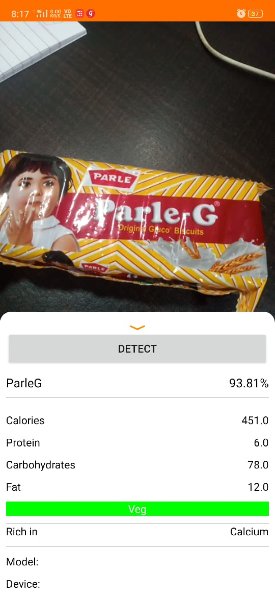

# Dr. Macro Health App

Android Application to get the Details of
the Macro Nutrients of the Product by
taking the picture of the product. also Warns
the user for specific health Condition like
High/Low BP, Diabetes, Lactose and
Peanut Allergies. Currently trained to detect only 10 Products.

### Tools Used  
- Android Studio - Java 
- TensorFlow Lite
- Google Teacheble Machine

#### Screenshots 

